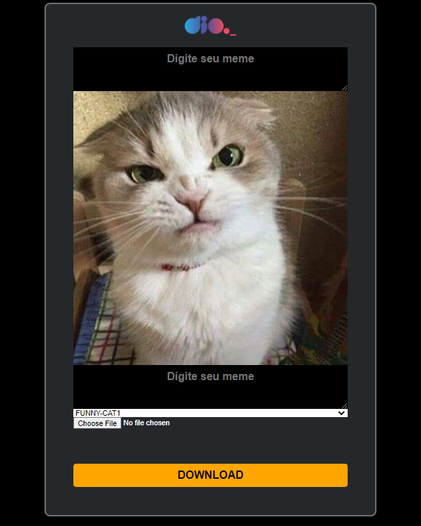

<h1 align="center"> Máquina de Memes </h1>

Evento exclusivo e gratuito, promovido pela DIO para ensino de tecnologias WEB.

  <a href="#-tecnologias">Tecnologias</a>&nbsp;&nbsp;&nbsp;|&nbsp;&nbsp;&nbsp;
  <a href="#-projeto">Projeto</a>&nbsp;&nbsp;&nbsp;|&nbsp;&nbsp;&nbsp;
  <a href="-biblioteca">Bibliotecas</a>

 

  

## 🚀 Tecnologias

Esse projeto foi desenvolvido com as seguintes tecnologias:

- HTML e CSS
- JavaScript

## 💻 Projeto

A máquina de memes é um projeto que permite a criação de memes a partir de imagens pré-definidas ou uploads feito pelo usuário.

## 📚 Biblioteca

Nesse projeto foi utilizado a biblioteca html2canvas disponível no [link](https://html2canvas.hertzen.com/) para realizar o print da tela para download.
